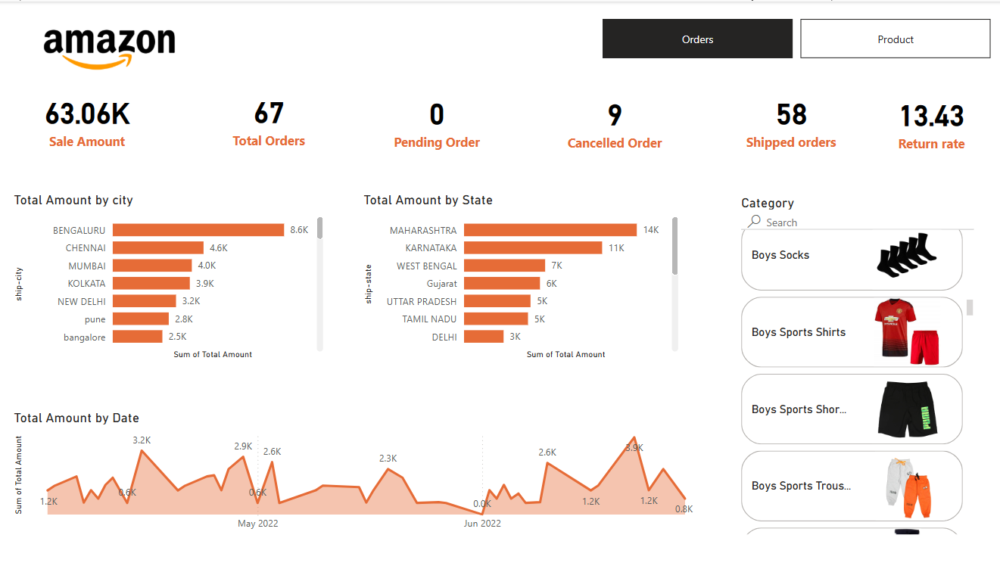
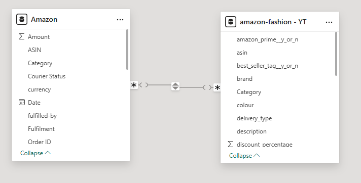

# Amazon Sales Reporting Dashboard (Power BI)

## 📊 Project Overview

This project is an interactive **Sales Reporting Dashboard** built in **Power BI** to analyze and visualize Amazon inventory and sales data.  
It empowers stakeholders to understand sales performance across different time periods, product categories, cities, and states, as well as track important KPIs and identify business opportunities.

---

## 🛠️ Project Structure

```plaintext
/Dashboard                   <- Main repo folder
    /Dashboard             <- Contains all dashboard screenshots
        Data_model.png
        orders_dashboard.png
        product_dashboard.png
        product_dashboard_2.png
        tooltip_example.png
    README.md                <- This file
    amazon_dashboard.pbix    <- Power BI dashboard file

---

## ⚡ Tech Stack

- **Power BI** (Dashboard & Data Modeling)
- **Power Query** (ETL/Data Cleaning)
- **DAX** (KPIs & Custom Measures)
- **Python & Statistics** (for additional data prep)
```
---
## 🚀 What We Did

### Data Modeling & Preparation

- Imported raw Amazon sales and product data into Power BI.
- Used **Power Query** for cleaning (fixing types, removing nulls, renaming fields).
- Built a **data model** with proper relationships to support flexible analysis.

### KPI Design & DAX Measures

- Defined key business metrics using custom **DAX**:
- Sale Amount, Total Orders, Pending/Cancelled Orders, Shipped Orders, Return Rate, Total Products, Total Reviews, Average Product Rating, Inventory Left, Prime/Best Seller Product Share, etc.
- Applied formatting and logic to display zero instead of blanks for all KPIs.

### Dashboard Development

- Created **two main dashboards**:
    - **Orders Dashboard:** High-level KPIs, sales by region, sales trends, fulfillment/returns, category slicers.
    - **Product Analytics Dashboard:** Product-level KPIs, interactive catalogue, Prime/best seller share, category filters, advanced tooltips.
- Added **custom tooltips** with extra metrics and time-series visuals.
- Included slicers for category-based filtering.
- Applied conditional formatting to highlight low stock or top performers.

### Visualization & Interactivity

- Used a mix of visuals (bar, line, pie, card, gallery) for maximum insight and presentation value.
- Enabled users to filter and drill-down with slicers, tooltips, and interactive visuals.

---

## 📈 Key Metrics & KPIs

- **Total Sale Amount**
- **Total Orders**
- **Pending Orders**
- **Cancelled Orders**
- **Shipped Orders**
- **Return Rate**
- **Total Products**
- **Total Reviews**
- **Average Product Rating**
- **Total Inventory Left**
- **Prime Product Percentage**
- **Best Seller Product Percentage**

> All measures built using custom **DAX** formulas for maximum accuracy and flexibility.

---

## 🖥️ Dashboard Features

### 1️⃣ Orders Dashboard

- **KPI Cards:** High-level summary of sales, orders, returns, and fulfillment.
- **Sales Breakdown by City and State:** Visualize which regions drive business.
- **Sales Trend Over Time:** See growth and seasonality.
- **Return Rate & Shipping Insights:** Track customer satisfaction and operational performance.
- **Dynamic Category Slicer:** Instantly filter all visuals by product category.

**Sample Screenshot:**  


---

### 2️⃣ Product Analytics Dashboard

- **Product-Level KPIs:** Inventory, reviews, ratings, and Prime/Best Seller share.
- **Interactive Product Catalogue:** Browse products by image and name.
- **Category Slicer:** Filter product list and KPIs.
- **Prime Product Share Pie Chart:** Visualize Prime-eligible vs. non-Prime products.
- **Custom Tooltips:** On hover, see detailed KPIs and sales trend for any product/category.

---

### Data Model

- **Entity Relationships:** Ensures accurate cross-table analytics and drilldowns.

**Screenshot:**  

---

### 3️⃣ Advanced Features

- **Custom Tooltips:** Hover over products or categories for instant deep dives (sales, orders, trend lines).
- **Drill-Through & Slicers:** Easily filter by category, brand, or time.
- **Conditional Formatting:** Instantly spot low inventory, top sellers, or outliers.

---

## 🏗️ Data Model & DAX Examples

**Sample Measures:**
```dax
Sale_Amount = SUM(Amazon[Total Amount])
Total Orders = COUNT(Amazon[Order ID])
Pending Order = CALCULATE(COUNT(Amazon[Order ID]), FILTER(Amazon, Amazon[Status] = "pending"))
Cancelled Order = CALCULATE(COUNT(Amazon[Order ID]), FILTER(Amazon, Amazon[Status] = "Cancelled"))
Shipped orders = [Total Orders] - [Pending Order] - [Cancelled Order]
Return rate = DIVIDE([Cancelled Order], [Total Orders], 0) * 100

```
---

## 📂 How to Use

1. Download the **Power BI (.pbix) file** from this repository.
2. Open in Power BI Desktop.
3. Refresh data if needed, or swap in your own inventory/sales table for instant insights.
4. Interact with dashboards: filter, slice, and drill-down to analyze your business!

---

## 🚀 Project Highlights

- **Full Sales & Inventory Visibility:** One-stop view for business decisions.
- **Extremely User-Friendly:** Custom tooltips, slicers, and interactivity.
- **Portfolio-Ready:** Professional polish for job interviews or business presentations.

---

## 👤 Author

- [Your Name](https://github.com/Ronakmishra)

---

## 📜 License

This project is released under the MIT License.
